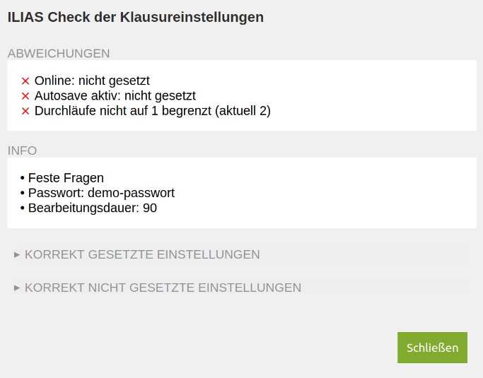

# ILIAStest-checkSettings
Script to easily check the settings of an ILIAS test object.

# Description
The script can be used as a bookmarklet on settings pages of ILIAS tests. You set your default settings in the script and get a quick feedback popup with warnings and information.



# How to
## Prerequisite
- Your ILIAS instance may need to adjust an adjustment of the content security policy settings regarding this script.
- Save the script to a location that your ILIAS instance can access. 
- Keep the direct link ready for later.

## Edit the script
- Open the script and edit the list of settings at the top.
- Each setting on the first and third test settings pages is listed with a name, id and number. 
- The number represents your preference for that setting. 

The options are:
1. Required: A setting with this number should be active. The script will give a warning, if it is not.
2. Forbidden: A setting with this number must not be set. You'll get a warning if it is.
3. Info if set: Use this number, if there is no default state for the setting, but you want to know if it is active. You'll see the name of the setting in the popup.
4. Info value: If the value of the setting is important (such as the duration of the exam), you can use this number to see the value of the setting in the popup.
5. Skip: A setting with this number will be skipped in the checks. 

There is an additional check for the maximum number of passes. The check is set to 1 try. You can change the number under the settings list.

## Create the bookmarklet
Create a bookmark and add the following line of code as the address. Change the link to where your script is stored (but leave the ?timestamp= part).

```
javascript:(function(){var timestamp = new Date().getTime(); var jsCode = document.createElement('script'); jsCode.setAttribute('src','https://path-to-file.de/checkSettings.js?timestamp=' + timestamp);document.body.appendChild(jsCode);})();
```

## Check the settings
Click on the bookmarklet while visiting the first or third ILIAS test settings page. A popup will show you the results.

# License
This project is licensed under the MIT license - see the LICENSE.md file for details